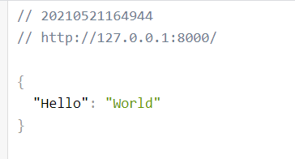
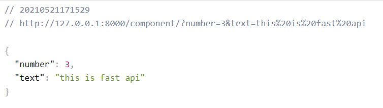

# FastAPI

* Install library

```bash
$ pip install virtualenv
$ python -m venv env
$ source env/Scripts/activate
(env) 
$ pip install fastapi
$ pip install uvicorn
```

```python
from fastapi import FastAPI

app = FastAPI()

# http method
@app.get('/')
async def hello_world():
    return {"Hello": "World"} # json response - handling url
```

```bash
$ uvicorn main:app --reload
INFO:     Uvicorn running on http://127.0.0.1:8000 (Press CTRL+C to quit)
INFO:     Started reloader process [16132] using statreload
INFO:     Started server process [21488]
....
```




> http://127.0.0.1:8000/docs
>
> http://127.0.0.1:8000/redoc           : read only

```python
# create parameter

@app.get("/component/") 

async def read_component(number: int, text: str): # query parameter

  return {"number": number, "text": text}
# http://127.0.0.1:8000/component/?number=3&text=this is fast api
```



# Pydantic

* Python library
* Data validation using python type `annotations`

